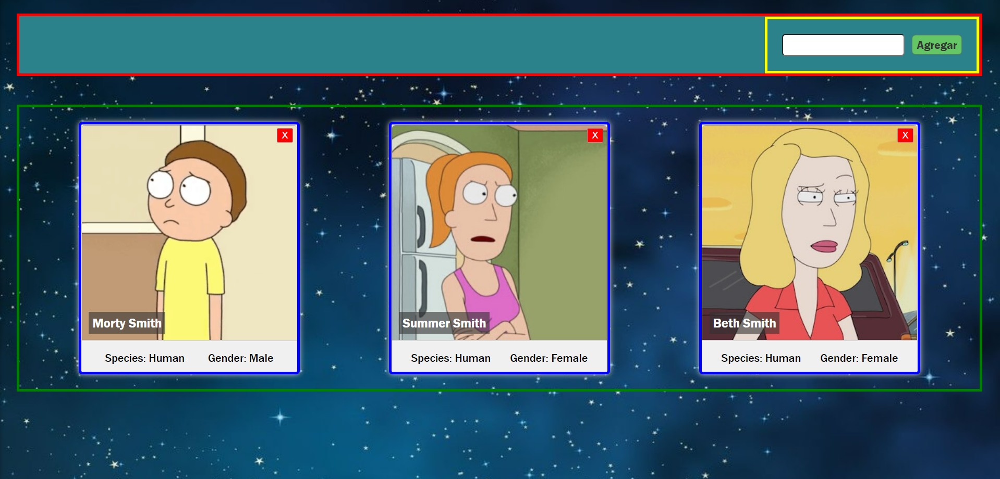
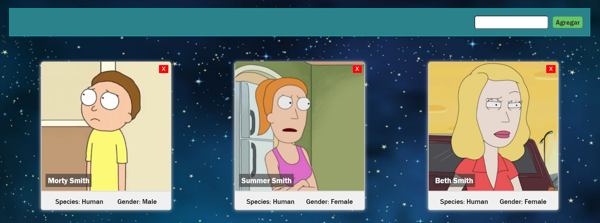

<!-- # Getting Started with Create React App

This project was bootstrapped with [Create React App](https://github.com/facebook/create-react-app).

## Available Scripts

In the project directory, you can run:

### `npm start`

Runs the app in the development mode.\
Open [http://localhost:3000](http://localhost:3000) to view it in your browser.

The page will reload when you make changes.\
You may also see any lint errors in the console.

### `npm test`

Launches the test runner in the interactive watch mode.\
See the section about [running tests](https://facebook.github.io/create-react-app/docs/running-tests) for more information.

### `npm run build`

Builds the app for production to the `build` folder.\
It correctly bundles React in production mode and optimizes the build for the best performance.

The build is minified and the filenames include the hashes.\
Your app is ready to be deployed!

See the section about [deployment](https://facebook.github.io/create-react-app/docs/deployment) for more information.

### `npm run eject`

**Note: this is a one-way operation. Once you `eject`, you can't go back!**

If you aren't satisfied with the build tool and configuration choices, you can `eject` at any time. This command will remove the single build dependency from your project.

Instead, it will copy all the configuration files and the transitive dependencies (webpack, Babel, ESLint, etc) right into your project so you have full control over them. All of the commands except `eject` will still work, but they will point to the copied scripts so you can tweak them. At this point you're on your own.

You don't have to ever use `eject`. The curated feature set is suitable for small and middle deployments, and you shouldn't feel obligated to use this feature. However we understand that this tool wouldn't be useful if you couldn't customize it when you are ready for it.

## Learn More

You can learn more in the [Create React App documentation](https://facebook.github.io/create-react-app/docs/getting-started).

To learn React, check out the [React documentation](https://reactjs.org/).

### Code Splitting

This section has moved here: [https://facebook.github.io/create-react-app/docs/code-splitting](https://facebook.github.io/create-react-app/docs/code-splitting)

### Analyzing the Bundle Size

This section has moved here: [https://facebook.github.io/create-react-app/docs/analyzing-the-bundle-size](https://facebook.github.io/create-react-app/docs/analyzing-the-bundle-size)

### Making a Progressive Web App

This section has moved here: [https://facebook.github.io/create-react-app/docs/making-a-progressive-web-app](https://facebook.github.io/create-react-app/docs/making-a-progressive-web-app)

### Advanced Configuration

This section has moved here: [https://facebook.github.io/create-react-app/docs/advanced-configuration](https://facebook.github.io/create-react-app/docs/advanced-configuration)

### Deployment

This section has moved here: [https://facebook.github.io/create-react-app/docs/deployment](https://facebook.github.io/create-react-app/docs/deployment)

### `npm run build` fails to minify

This section has moved here: [https://facebook.github.io/create-react-app/docs/troubleshooting#npm-run-build-fails-to-minify](https://facebook.github.io/create-react-app/docs/troubleshooting#npm-run-build-fails-to-minify)
 -->
<!-- # HW 08: React-Estado-LifeCycle | Integración

## **Duración estimada 🕒**

50 minutos

<br />

---

## **Rick & Morty App**

### **INTRO**

Hasta el momento, en nuestra Rick & Morty App tenemos estos 3 Componentes:

-  Card.jsx
-  Cards.jsx
-  SearchBar.jsx

Adicionalmente, vamos a crear otro componente denominado `Nav` que será nuestra barra superior de navegación, en la cual incluiremos el componente `SearchBar`.

También vamos a reestructurar nuestra vista **_"Home"_**, que no es más que nuestro archivo `App.js` para darle una forma más ordenada.

<br />

---

### **COMENCEMOS**

En el archivo `App.js` ya tenemos importados y estamos renderizando los 3 componentes que vamos a codear. Revisa el código, verás que le estamos pasando props a estos componentes.

<br />

---

### **👩‍💻 EJERCICIO 1**

### **Crear Nav**

1. Crear el componente `Nav`.
2. Escribir el código correspondiente en `components/Nav.jsx`.

> **Hint**: Este componente debe incluir el componente `SearchBar`.

<br />

---

### **👩‍💻 EJERCICIO 2**

### **Reestructurar Home**

1. Veamos primero una imagen del resultado final y pensemos la estructura general:



> -  **Recuadro rojo**: Nav
> -  **Recuadro amarillo**: SearchBar
> -  **Recuadro verde**: Cards
> -  **Recuadro azul**: Card

2. Ahora vamos a modificar el contenido del archivo `App.js`:

   -  En `App` sólo vamos a renderizar los componentes `Cards` y `Nav`.
   -  Ya no vamos a renderizar la primera `Card` "suelta" que pusimos en la primera clase. Ahora el componente `Cards` será quien contenga todas las `Card` individualmente.
   -  Lo mismo sucede con `SearchBar`. No lo vamos a seguir renderizando de forma directa en App, debido a que ya se encuentra dentro de `Nav`.

3. Importar y renderizar los componentes que vamos a utilizar.
4. Aplicar estilos básicos al componente **_Nav_**.

🔹 Resultado esperado:



<br />

---

### **👩‍💻 EJERCICIO 3**

### **Implementar un estado**

Necesitamos mantener actualizado el listado de personajes a mostrar. Para ello debemos crear un estado en el componente `App.js` donde tengamos el array de personajes.

1. Borra el import que traes de data.js (ya no vamos a usar más los datos de este archivo).
2. Importa el hook useState.
3. Crea un estado `characters` donde guardaremos el array de personajes.

<br />

---

### **👩‍💻 EJERCICIO 4**

### **Función para agregar personajes**

Ahora debemos crear una función llamada `onSearch` para agregar nuevos personajes a nuestro estado `characters` y se la pasaremos al `SearchBar` mediante el `Nav`.

> **Hint**: Como aún no hemos hecho el llamado a la API para obtener los datos del personaje, agregamos uno por default para ver que esté funcionando:

```jsx
const example = {
   name: 'Morty Smith',
   species: 'Human',
   gender: 'Male',
   image: 'https://rickandmortyapi.com/api/character/avatar/2.jpeg',
};
```

<br />

---

### **👩‍💻 EJERCICIO 5**

### **Le pasamos la función a Nav**

Nuestra función recién creada (que modifica el estado `characters`) se la pasamos al componente `Nav`.

<br />

---

### **👩‍💻 EJERCICIO 6**

### **Seguimos pasando la función para que llegue a su destino**

Quien finalmente debe ejecutar la función `onSearch` no es el `Nav` sino el `SearchBar`, por lo que debemos hacerle llegar dicha función.

<br />

---

### **👩‍💻 EJERCICIO 7**

### **Analizando función onSearch**

En la homework anterior **06-React-Intro, 02 - Integration**, ya habíamos creado el componente `SearchBar` que recibía la función como parámetro y la ejecutaba cuando se hacía un `submit` del form.

En este punto la función ya debería ejecutarse. Cada vez que le demos click al botón `Agregar` un nuevo personaje se añade a nuestro estado `characters`, y por cada uno de ellos nuestro componente `Cards` renderiza una `Card`.

Si observamos el código anterior estamos llamando a la función `onSearch` sin pasarle ningún parámetro, pero quisiéramos que ese parámetro dependa del input ingresado por el usuario.

<br />

---

### **👩‍💻 EJERCICIO 8**

### **Pasándole parámetros a la función**

1. Modifica el componente `SearchBar` para que mantenga un **estado** interno del nombre del personaje (`character`) escrito por el usuario y que cuando haya un cambio en el input, lo detecte mediante el listener `onChange` y actualice dicho estado.

2. Adicionalmente, pasar dicho estado `character` como parámetro de la función `onSearch` cuando la llamamos en el `submit`; para que utilice el estado, que contiene lo que ingresó el usuario y éste valor llegue así a la función **_onSearch_** que tenemos en **App.js**.

<br />

---

### **👩‍💻 EJERCICIO 9**

### **Buscando datos reales**

1. Comenta el código que engloba la constante **example**

2. Ahora debemos modificar la función `onSearch` para que obtenga los datos necesarios desde la API de [Rick&Morty](https://rickandmortyapi.com). Para ello vamos a utilizar `fetch` para hacer la llamada y obtener el resultado. Por el momento sólo vamos a obtener los personajes por ID, ya que si los buscamos por nombre hay demasiados resultados debido a que los mismos se repiten bastante.

3. Mostrar un mensaje en caso de que el personaje no exista.

> **Hint**: Como aún no has visto promesas, tienes este snippet para que copies y pegues la función **_onSearch_**:

```js
function onSearch(character) {
   fetch(`https://rickandmortyapi.com/api/character/${character}`)
      .then((response) => response.json())
      .then((data) => {
         if (data.name) {
            setCharacters((oldChars) => [...oldChars, data]);
         } else {
            window.alert('No hay personajes con ese ID');
         }
      });
}
```

> **Nota**: si tienes conocimiento base en promesas y deseas hacerlo de otra manera, puedes hacer la llamada utilizando `axios` para traer los datos. En caso que no, te invitamos a que veas el código y analices qué puede estar pasando.💡

<br />

---

### **👩‍💻 EJERCICIO 10**

### **Cerrar cards**

Por último, recordemos que en la homework anterior **06-React-Intro, 02 - Integration** habíamos creado el componente `Card` para que reciba una función como parámetro. Ésta va a ser la encargada de eliminar esa card al momento de hacer click en el botón `X`.

Para ello es necesario definir dicha función `onClose` en **App.js**, para que a partir del id recibido, elimina dicho personaje del array de personajes del **_estado_**.

> **Hint**: Puedes utilizar el método `filter`.

---

🔹 Resultado esperado:


Listo! tu app es ahora dinámica e interactiva!! 👏🏼🚀

<br />

---

## **📌 EJERCICIO EXTRA**

-  Controlar que no se puedan agregar personajes repetidos.
-  Generar un botón en la navbar que agregue un personaje random (Hint: hay 826 personajes en total).
 -->

 # HW 09 - React-Routing | Integración

## **Duración estimada 🕒**

50 minutos

<br />

---

## **Rick & Morty App**

### **INTRO**

Continuamos con nuestra Rick & Morty App. Utilizaremos React-Router-DOM el cual nos va a permitir enrutar nuestra SPA. Esto quiere decir que podremos decidir en que path o "link" se renderice cada componente.

Al finalizar, habremos creado tres rutas por las que podremos navegar:

- **"/home"**: esta será la ruta del Home (vista principal/general).
- **"/detail/:detailId"**: en esta ruta encontraremos información más detallada sobre el personaje en particular.
- **"/about"**: en esta ruta colocarás tu nombre y describirás de qué trata la aplicación Rick & Morty.

<br />

---

## **COMENCEMOS**

Vamos a comenzar creando los componentes que nos faltan en nuestra carpeta components. Creamos `About.jsx` y `Detail.jsx` con sus respectivos archivos. Sólo los crearemos, aún no los construiremos. También creamos el archivo `.css` para el estilado. Recuerda que puedes utilizar cualquier formato de estilos (in-line, module, styled components, etc)

Cómo sabemos, `react-router-dom` nos da la posibilidad de crear rutas dinámicas. Estas rutas serán los path o links en el que se renderizará el componente que nosotros decidamos. Para este ejercicio queremos que en cada link se vea lo siguiente:

- `<Nav />` debe que aparecer en todas las rutas.
- `<Cards />` debe aparecer sólo en la ruta `/home`.
- `<About />` debe aparecer sólo en la ruta `/about`.
- `<Detail />` debe aparecer sólo en la ruta `/detail/:detailId`

<br />

---

### **👩‍💻 EJERCICIO 1**

### **Instalar y configurar `react-router-dom`**

Instala `react-router-dom` desde la terminal. Importa y envuelve la aplicación con "**BrowserRouter**" en el archivo index.js.

Importa los elementos "**Routes**" y "**Route**", para que luego definamos las rutas en el archivo app.js.

<br />

---

### **👩‍💻 EJERCICIO 2**

### **Mi perfil**

Ahora si construiremos el componente `<About />`. Este componente será una vista que contenga tu información y una explicación acerca de la aplicación!

Esto significa que es completamente libre. Puedes mostrar incluso una foto tuya. Esto le servirá a las personas que vean tu App para conocer al creador 🤠✨.

En la Navbar agrega el link About que dirija al componente **About** y el link Home para que dirija al componente **Home**.

<br />

---

### **👩‍💻 EJERCICIO 3**

### **Routing time!**

En nuestro archivo "app.js" (aplicación), crea las rutas necesarias para que los componentes `<About />`, `<Cards />` y `<Nav />` se rendericen en sus links correspondientes. Recuerda que en el **EJERCICIO 1** ya están especificadas las rutas.

Respecto al componente `<Detail />`, su ruta recibirá el parámetro **detailId**, por lo que debes asegurarte de escribir bien el path de esta ruta.

> **Nota:** Comprueba en tu navegador que los links rendericen el componente correcto, y que el componente `<Nav />` se vea siempre.

<br />

---

### **👩‍💻 EJERCICIO 4**

### **Detail redirection**

Ahora nuestra SPA cuenta con tres rutas distintas: "`/home`", "`/detail/:detailId`" y "`/about`".

Para este ejercicio:

1. En el componente `<Card />` importa y envuelve el nombre del personaje con el elemento "**Link**". Tiene que redirigirnos a la ruta de cada personaje.
2. A este componente deberás pasarle por **props** el "**id**" del personaje para usarlo en el Link.

```js
// Card.js
...
<Link to={`/detail/${props.id}`} >
  <h5 className="card-title">{props.name}</h5>
</Link>
...
```

<br />

---

### **👩‍💻 EJERCICIO 5**

### **Construcción del Detail**

¡Genial! Cuando hacemos click sobre el nombre en una Card esta nos redirige a la ruta con el ID del personaje. Ahora necesitamos crear el componente que mostrará toda la información del personaje.

Para obtener esta información importa los hooks **useState** de `react` y **useParams** de `react-router-dom` en el componente `<Detail />`.

1. Primero obten el ID del personaje mediante **useParams**.

2. Crea un estado local con el nombre **character**.

3. En este paso importaremos el hook **useEffect** de `react`. Una vez importado, copia el siguiente código y pégalo en el cuerpo del componente.

```js
useEffect(() => {
  fetch(`https://rickandmortyapi.com/api/character/${detailId}`)
    .then((response) => response.json())
    .then((char) => {
      if (char.name) {
        setCharacter(char);
      } else {
        window.alert("No hay personajes con ese ID");
      }
    })
    .catch((err) => {
      window.alert("No hay personajes con ese ID");
    });
  return setCharacter({});
}, [id]);
```

> **NOTA:** Este código es el que buscará al personaje de la API cada vez que el componente se monte. Y luego, cada vez que se desmonte, borrará su información.

<br />

---

### **👩‍💻 EJERCICIO 6**

Ahora en tu estado local **character** tendrás toda la información del personaje disponible para que la renderices en este componente (`<Detail />`). Debes traer la siguiente información:

- Name
- Status
- Specie
- Gender
- Origin
- Image

Dándole estilos debería quedarte algo similar a esto:


<br />

---

### **👩‍💻 EJERCICIO 7**

Crea un botón en el componente `<Detail />` que te permita regresar a "`/home`".

<br />

---

### **📌 EXTRA CREDIT**

Ahora te desafiamos a que crees un nuevo componente llamado **Error**. A este componente le podrás dar los estilos que quieras, pero la idea es que se muestre un mensaje de error 404.

Pueden inspirarte en el siguiente link: "https://github.com/errroorrxd".

El desafío es el siguiente: haz que este componente se muestre cada vez que el usuario ingrese a cualquier otra ruta que no exista. Es decir que no la hayas especificado en esta homework. Por ejemplo, si creaste una ruta "`/home`" y "`/about`", y el usuario en el navegador escribe y "`/henry`", debería mostrar el error 404.
